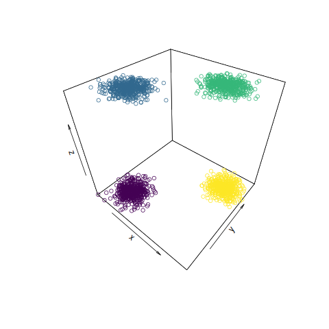
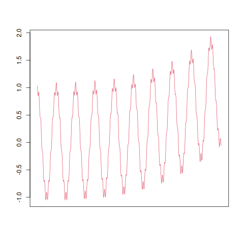

# Integrating Static and Dynamic Hierarchical Clustering

  
   

R code for mixed clustering synthetic data and benchmarking simulation.

* `notebooks`: contains the different synthetic data and benchmark procedures  used.
* `R`: contains frequently used code in the above notebooks.
* `data`: the obtained simulation data.